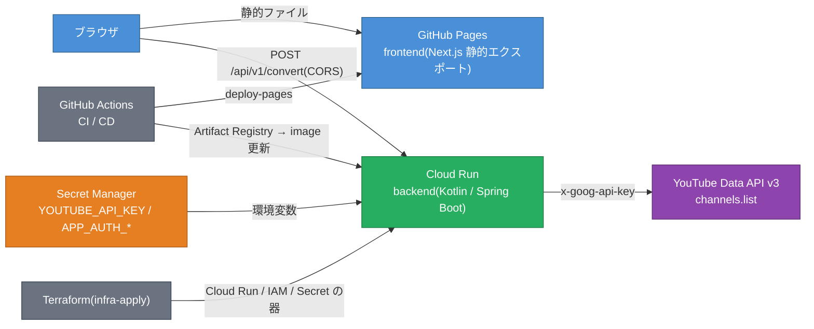

# youtube-handle-id-converter

[](https://github.com/otajisan/youtube-handle-id-converter/actions/workflows/backend-ci.yml) [](https://github.com/otajisan/youtube-handle-id-converter/actions/workflows/infra-ci.yml) [](https://github.com/otajisan/youtube-handle-id-converter/actions/workflows/frontend-ci.yml)

> YouTube のハンドル(`@handle`)と Channel ID(`UC...`)を相互変換する Web ツール

**公開 URL: https://otajisan.github.io/youtube-handle-id-converter/**

## 使い方

1. テキストエリアに **1 行 1 件** で入力する(最大 10 件、混在可)
   - ハンドル: `@youtube`(先頭の `@` は省略可)
   - Channel ID: `UCBR8-60-B28hp2BmDPdntcQ`
   - YouTube URL: `https://www.youtube.com/@youtube`、`youtube.com/channel/UC...`
2. 「変換する」を押すと、入力順にハンドル / Channel ID / チャンネル名 / サムネイルが表示される
3. 行ごとのコピー、または全件を TSV でコピーできる

| 結果の状態 | 意味 |
|---|---|
| 変換済み | 変換に成功。ハンドル未設定のチャンネルはハンドルが `—` になる |
| 見つかりません | 該当するチャンネルが存在しない |
| 不正な入力 | 上記の形式として解釈できない(理由が併記される) |

### 10 件制限と Quota

このツールは YouTube Data API v3 を **1 つの API Key で全員が共有**して利用しており、1 日の割り当て(Quota)は既定の 10,000 unit です。

- 1 リクエストの消費 = **ハンドルの件数 + (Channel ID があれば 1)** unit。Channel ID は 1 回の API 呼び出しにまとめて引くため、10 件すべて Channel ID なら 1 unit、すべてハンドルなら 10 unit
- 不正な入力と重複は API を呼ばない
- 1 リクエストの上限は 10 件(運用者が `APP_MAX_INPUTS` で変更可能)

### 割り当てを使い切ったとき

割り当てを使い切ると、翌日の **太平洋時間 0 時(日本時間 16 時 / 夏時間中は 17 時)** にリセットされるまで変換できません。画面には「1 日の割り当てを使い切りました」とリセット時刻が表示されます(backend は 429 を返す)。bot 等による急激な消費が起きた場合、運用者はメンテナンスモードや Basic 認証で利用を制限します([`docs/operations.md`](docs/operations.md))。

## アーキテクチャ



- **frontend** は静的サイトで、API Key を持たない。ブラウザから直接 backend を呼ぶ
- **backend** が API Key を秘匿し、入力検証・Quota 最適化・保護機構(メンテナンスモード / Basic 認証 / レートリミット)を担う
- **GCP** のリソースは Terraform で管理し、GitHub Actions からは Workload Identity Federation で認証する(JSON キーなし)

## 構成

| ディレクトリ | 内容 | 詳細 |
|---|---|---|
| [`backend/`](backend/) | Kotlin 2.4 + Spring Boot 4.1(JDK 25)。YouTube Data API v3 の呼び出しと API Key の秘匿、保護機構。Cloud Run にデプロイ | [`backend/README.md`](backend/README.md) |
| [`frontend/`](frontend/) | Next.js 16 + TypeScript(Node 24)。静的エクスポートして GitHub Pages で公開 | [`frontend/README.md`](frontend/README.md) |
| [`infra/`](infra/) | Terraform による GCP リソース定義(`yt-handle-id-converter` / `asia-northeast1`)と bootstrap スクリプト | [`docs/infra.md`](docs/infra.md) |
| [`docs/`](docs/) | 運用手順・インフラ手順 | [`docs/operations.md`](docs/operations.md) |

## ローカル開発

### 必要なもの

- Docker(compose v2)
- Node.js 24 と pnpm 12(frontend。`package.json` の `packageManager` でバージョン固定)
- JDK 17 以上(Gradle の起動用。コンパイル・実行用の JDK 25 は Gradle toolchain が自動取得)
- YouTube Data API v3 の API Key([Cloud Console](https://console.cloud.google.com/apis/credentials) で発行。API の制限を YouTube Data API v3 のみにする)

### backend + frontend を起動する

```bash
# 1. API Key を設定する(.env は git 管理外)
cp .env.example .env            # YOUTUBE_API_KEY=... を記入

# 2. backend を Docker で起動する
docker compose up --build       # http://localhost:8180(Actuator の 8181 はホストに公開しない)

# 3. frontend を起動する(別ターミナル)
cd frontend
pnpm install --frozen-lockfile  # pnpm は package.json の packageManager で固定(corepack 不要。未導入なら npm i -g pnpm)
cp .env.example .env.local      # NEXT_PUBLIC_API_BASE_URL=http://localhost:8180(既定値のままでよい)
pnpm dev                        # http://localhost:3000/youtube-handle-id-converter/
```

backend の既定の CORS 許可オリジンは `http://localhost:3000` なので、そのままブラウザから変換できる。

### Gradle で backend を直接動かす

```bash
cd backend
./gradlew check                          # ktlint → test → Jacoco(line 80% 未満で失敗)
YOUTUBE_API_KEY=... ./gradlew bootRun    # app: http://localhost:8180 / health: http://localhost:8181/actuator/health
```

### 動作確認(curl)

```bash
# 不正な入力は API を呼ばず、Quota を消費しない
curl -s -X POST http://localhost:8180/api/v1/convert \
  -H 'Content-Type: application/json' \
  -d '{"inputs":["@youtube","UCBR8-60-B28hp2BmDPdntcQ","not valid!"]}'

# OpenAPI 定義
curl -s http://localhost:8180/v3/api-docs
```

## CI / CD

すべて GitHub Actions。PR では lint / test / build / 依存脆弱性チェックが required check になっており、`main` へのマージで自動デプロイされる。

| ワークフロー | PR | `main` マージ |
|---|---|---|
| [backend](.github/workflows/backend-ci.yml) | ktlint / test / Jacoco、依存グラフ送信 + dependency-review、Docker build + 起動確認 | Artifact Registry に push → Cloud Run の image を更新 → スモークテスト |
| [frontend](.github/workflows/frontend-ci.yml) | lint / typecheck / test / build、dependency-review | GitHub Pages にデプロイ → `build-sha` を検証 |
| [infra](.github/workflows/infra-ci.yml) | fmt / validate / tflint / trivy、`terraform plan` を PR にコメント | `terraform apply`(Environment `production`) |

Dependabot が依存関係(gradle / npm(pnpm-lock.yaml)/ docker / terraform / github-actions)を週次で更新する。

## 運用

Quota 枯渇時の緊急停止(メンテナンスモード)、Basic 認証の ON / OFF、レートリミット、上限件数の変更、Dependabot アラートの対応方針は [`docs/operations.md`](docs/operations.md)。GCP の bootstrap と Terraform の実行方法は [`docs/infra.md`](docs/infra.md)。

## 開発状況

開発計画は [Epic #1](https://github.com/otajisan/youtube-handle-id-converter/issues/1) を参照。

## ライセンス

[MIT](LICENSE)
